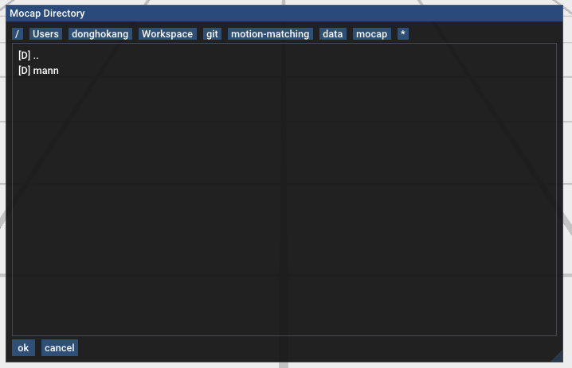
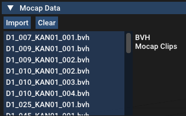
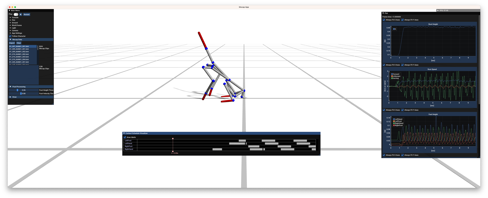
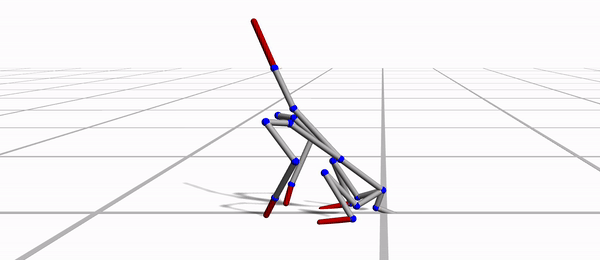

# motion-matching

Code base for the project: Motion Matching for Responsive Animation For Digital Humans.

## Getting started

We recommend [JetBrains CLion](https://www.jetbrains.com/clion/) for the development.
It is a paid software, but JetBrains has the [student plan](https://www.jetbrains.com/community/education/#students)
that provides free licenses. See [this](https://www.jetbrains.com/help/clion/clion-quick-start-guide.html) for a quick
start guide.

1. Fork this repository and download the code.

2. Build the project (or build `mocapApp`). You can build the project in cmake Release mode for realtime performance:
   see [this](https://www.jetbrains.com/help/clion/cmake-profile.html) for a guide about cmake profile for CLion.

3. Run the `mocapApp`.

4. Click `Main Menu > Mocap Data > Import` button, and navigate to the example bvh mocap data
   directory `data/mocap/mann`.
   Select the folder to import the whole clips within the directory.

   

   Once you successfully import the data, you will see the list of the motion data clip as follows

   

5. Click a motion clip to play. The character will show up in the screen.

   

6. Press the space bar or click the play toggle to play the clip.

   

7. Play around it! And try understanding the code. Don't hesitate to contact Dongho (kangd@ethz.ch) if you have any
   question
   regarding the implementation.

## Immediate Next steps

- Find bvh format mocap dataset of human motion recording and try importing it. You may need a bit of minor debugging to
  do that.
- Implement motion matching without blending: see the followings for references
    - https://donghok.me/assets/pdf/kang2021animal.pdf
    - https://www.gdcvault.com/play/1023280/Motion-Matching-and-The-Road
    - https://montreal.ubisoft.com/en/introducing-learned-motion-matching/
- Implement blending algorithm (e.g. inertialization)
    - https://youtu.be/BYyv4KTegJI
- (optional) Implement motion retargeting for Bob model

## Comments

- If you want to start from scratch (instead of using this code), feel free to do it!
- This repo will be keep updated, so please stay tuned. If you want to sync your repo with the new commits,
  use ```git rebase``` instead of ```git merge```:
  see [this](https://www.atlassian.com/git/tutorials/merging-vs-rebasing) for more details of ```git rebase```.
- Please actively use GitHub issue for questions and reporting issues on the code base!